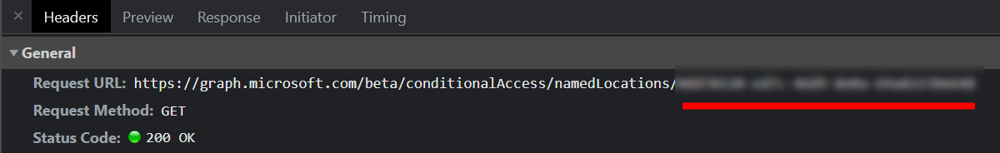
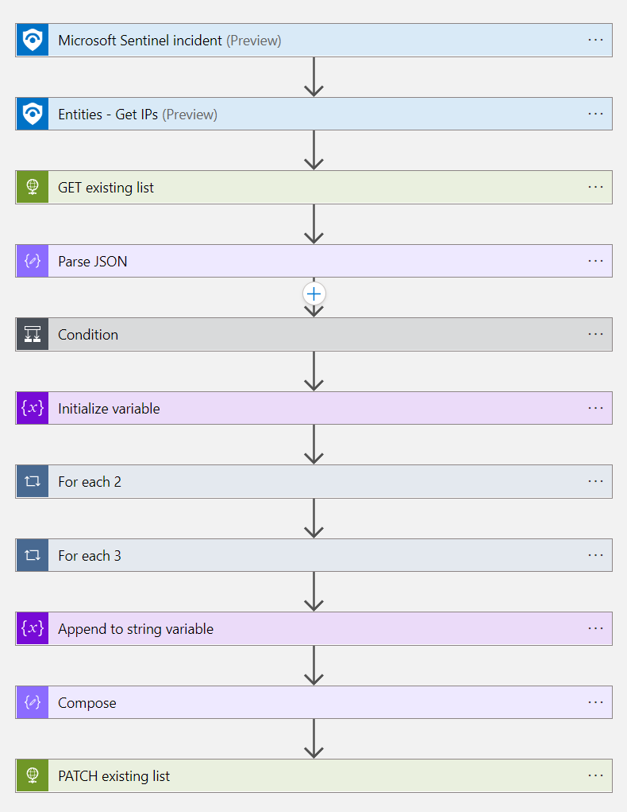

# BlockIP-NamedLocation

This playbook takes IP address entities from a Sentinel incident and adds them
to a Conditional Access IP range named location.

## Requirements

You'll need an Azure AD application with access to the Microsoft Graph API. To setup:
* create a new Enterprise Application
* assign both the Policy.Read.All and Policy.ReadWrite.ConditionalAccess permissions
(either delegated or application)
* have an administrator grant consent for the permissions

Once the application has been created and permissions granted, create a new 
client secret and save the Application (client) ID and client secret for later.

You'll also need the GUID of the IP range Named Location you want to add IPs to.
You can get this via the [API](https://learn.microsoft.com/graph/api/conditionalaccessroot-list-namedlocations?view=graph-rest-1.0&tabs=http), 
or by using your browsers web inspector and viewing the network tab after clicking the named location:

## Post deployment configuration

After deploying the template, you'll need to update the HTTP steps with the 
OAuth app details created earlier. Select 'Add new parameter' then 'Active 
Directory OAuth' and fill in the following:

* Authority - `https://login.microsoft.com`
* Tenant - your Azure tenant ID
* Audience - `https://graph.microsoft.com`
* Client ID - the client ID for your app
* Credential type - secret
* Secret - the client secret for your app

You'll also want to make sure your condtional access policies are set to block
login attempts from this list.

## Screenshot

