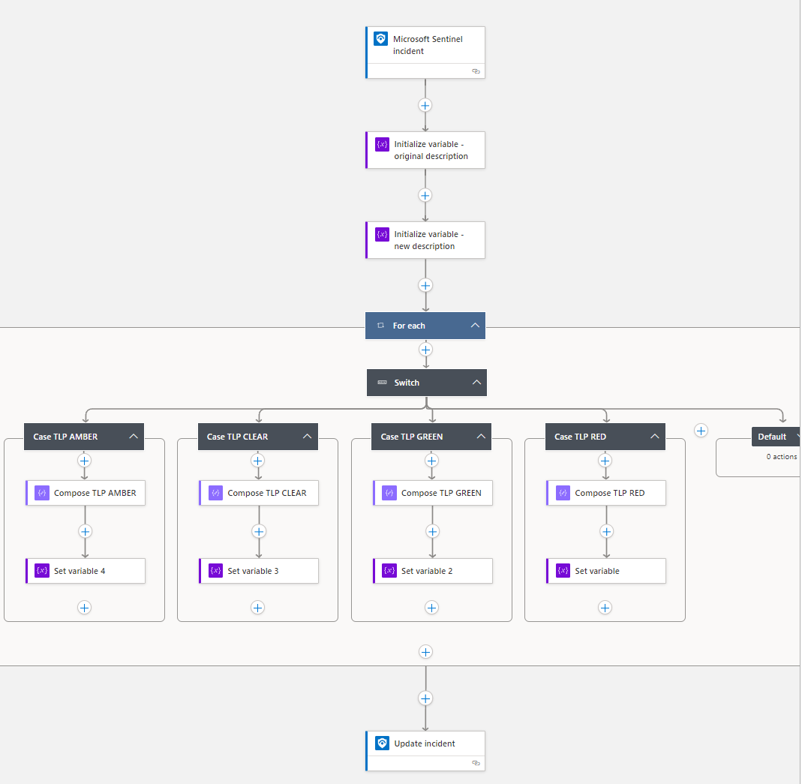

# UpdateIncident-AddTLPBanner

This playbook is designed to add a fancy banner representing the Traffic Light Protocol (TLP) classification for an incident.

## Requirements

This playbook has been designed to check for existing incident tags in the format "TLP: <VALUE>". No other requirements necessary.

## Deploy to Azure

## Screenshot

