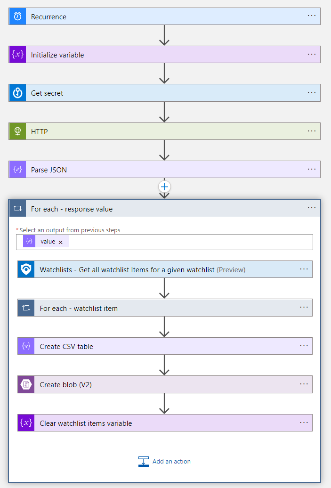

# Watchlist-Backup

This playbook is designed to perform regular backups of your Microsoft Sentinel
 watchlists and store the backups in Azure blob storage.

## Requirements

This playbook utilizes an Azure AD app registration to authenticate to the 
Azure API. You'll want to create a new app registration before deploying this template.

## Resources

The ARM template deploys the following resources:

* The logic app with managed identity
* A key vault which stores the client secret for your AAD app registration
* A storage account and blob storage container to hold the Watchlist backups

The template will also assign the following roles:

* The logic app managed identity will be assigned Sentinel Responder role a the 
resource group level
* The logic app managed identity will be assigned Storage Blob Data Contributor 
at the resource level
* The logic app managed identity will be assigned Key Vault Secrets User
at the resource level

## Deploy to Azure

## Screenshot

